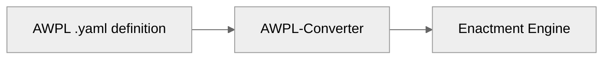

# Architecture

This document describes the architecture of AWPL and the supporting infrastructure.

### Core Components

| Component               | Description                                                 |
|-------------------------|-------------------------------------------------------------|
| **Language Constructs** | Tasks, loops, branches, and maps that define workflow logic |
| **Configuration**       | Resource hints and runtime-specific settings                |
| **JSON Schema**         | validation `schema.json` for AWPL definitions               |

### Documentation Site

This project is built using **Jekyll** with the **just-the-docs** theme.

### Directory Structure

| Path                     | Purpose                               |
|--------------------------|---------------------------------------|
| `index.md`               | Landing page / Getting Started        |
| `configuration.md`       | Configuration reference               |
| `language-constructs/`   | Task, Loop, Branch, Map documentation |
| `configuration/runtime/` | Runtime-specific configuration        |
| `examples/`              | AWPL workflow examples                |
| `schema.json`            | JSON Schema for validation            |
