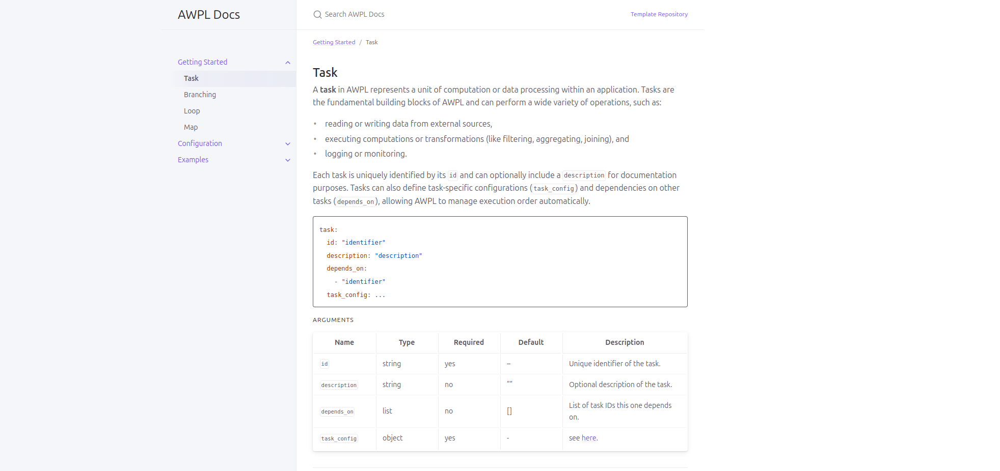

# Examples

### Start AWPL documentation Jekyll

```bash
$ cd src/
$ bundle install
Bundle complete! 2 Gemfile dependencies, 39 gems now installed.
Bundled gems are installed into `./vendor/bundle`
$ bundle exec jekyll serve
Configuration file: /home/stefan/git/spice-uibk/awpl-docs/src/_config.yml
            Source: /home/stefan/git/spice-uibk/awpl-docs/src
       Destination: /home/stefan/git/spice-uibk/awpl-docs/src/_site
 Incremental build: disabled. Enable with --incremental
      Generating... 
      Run in verbose mode to see all warnings.
                    done in 0.756 seconds.
 Auto-regeneration: enabled for '/home/stefan/git/spice-uibk/awpl-docs/src'
    Server address: http://127.0.0.1:4000/awpl-docs/
  Server running... press ctrl-c to stop.
```



