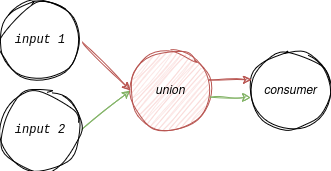

# Apache Flink

{: .important }
The flink runtime restricts the AWPL operators due to runtime limitations. For instance, the loop operator does not support the `loop_data` structure and asserts its absence to avoid unexpected behavior. Loops always use the last iteration's output as their input and cannot refer to an arbitrary task's output. The same is true for the branch operator, which also forbids referring to any task except `$prev`. This same constraint is also true for the map operator's input.

## Application specific configuration

An application `config` in AWPL defines settings that apply to the application as a whole.

```yaml
config:
  flink:
    libraries: [ "path/to/a.jar", "path/to/b.jar" ]
    parallelism: 1
```

#### Arguments

| Name                        | Type   | Required | Default     | Description                                                                                         |
|-----------------------------|--------|----------|-------------|-----------------------------------------------------------------------------------------------------|
| `libraries`                 | array  | no       | –           | Specifies an array of jar-files to be loaded into the classpath containing operator implementations |
| `parallelism`               | int    | no       | 1           | Default number of replicas per task unless overriden by task.                                       |

## Task specific configuration

Flink operators are mapped to AWPL `tasks` and utilize a specific `task_config`. The type of operator is determined by the `task_config`. The application config `parallelism` option can be overriden in each `task`. The `S` and `M` labels in the operator headings clarify whether the operator consumes one or multiple inputs and are added only for documentation purposes.

---

### (S) source

{: .note }
`com.example.MySource` must be an implementation of [`Source<Type, Split, CheckpointState>`](https://nightlies.apache.org/flink/flink-docs-stable/api/java/org/apache/flink/api/connector/source/Source.html) and loaded into the classpath.

A source can be specified in a variety of ways: `socket` allows connecting to a TCP socket, `topic` allows specifying a Kafka topic, and `class` allows specifying a class that can be used for entirely custom sources. Exactly one of the three options must be specified.

```yaml
task:
  id: "source"
  depends_on: []
  task_config:
    flink:
      source:
        socket: "127.0.0.1:8000"?
        topic: "input-topic"?
        class: "com.example.MySource"?
```

### (S) sink

{: .note }
`com.example.MySink` must be an implementation of [`SinkFunction<Type>`](https://nightlies.apache.org/flink/flink-docs-stable/api/java/org/apache/flink/streaming/api/functions/sink/legacy/SinkFunction.html) and loaded into the classpath.

{: .note }
The socket connector acts as a TCP client. It connects to the specified IP address and port and does not listen for requests.

A sink can also be specified in a variety of ways: `stdout` outputs to the standard output stream, `socket` allows connecting to a TCP socket, `topic` allows specifying a Kafka topic, and `class` allows specifying a `Sink` class that can be used for entirely custom sources. Exactly one of the four options must be specified.

```yaml
task:
  id: "sink"
  depends_on:
    - "task"
  task_config:
    flink:
      sink:
        stdout: ?
        socket: "127.0.0.1:8000"?
        topic: "output-topic"?
        class: "com.example.MySink"?
```

### (S) key_by

`key_by` groups all elements with the same key into the same partition.

{: .warning }
In this example, the previous task must supply an object and `id` must be an attribute of the input object, such that `object.id` exists.

```yaml
task:
  id: "group_by_key"
  depends_on:
    - "task"
  task_config:
    flink:
      key_by: "id"
```

### (S) filter

`filter` filters the input and only returns elements for which the filter returns true.

{: .note }
`com.example.MyFilter` must be an implementation of [`FilterFunction<Type>`](https://nightlies.apache.org/flink/flink-docs-stable/api/java/org/apache/flink/api/common/functions/FilterFunction.html) and loaded into the classpath.

```yaml
task:
  id: "filter_input"
  depends_on:
    - "task"
  task_config:
    flink:
      filter:
        class: "com.example.MyFilter"
```

### (S) flat_map

`flat_map` takes one element and produces zero, one, or more output elements.

{: .note }
`com.example.MyFlatMapFunction` must be an implementation of [`FlatMapFunction<InType, OutType>`](https://nightlies.apache.org/flink/flink-docs-stable/api/java/org/apache/flink/api/common/functions/FlatMapFunction.html) and loaded into the classpath.

```yaml
task:
  id: "flat_map"
  depends_on:
    - "task"
  task_config:
    flink:
      flat_map:
        class: "org.example.MyFlatMapFunction"
```

### (S) process

`process` is a generic, user-definable operator that is invoked for every event received in the input stream. It provides 'low-level' access to state, timers and time (e.g. event time)

{: .note }
`com.example.MyProcessFunction` must be an implementation of [`ProcessFunction<InType, OutType>`](https://nightlies.apache.org/flink/flink-docs-stable/api/java/org/apache/flink/streaming/api/functions/ProcessFunction.html) and loaded into the classpath.

```yaml
task:
  id: "process"
  depends_on:
    - "task"
  task_config:
    flink:
      process:
        class: "org.example.MyProcessFunction"
```

### (S) reduce

`reduce` combines the current element with the last reduced value and emits the newly reduced value.

{: .note }
`com.example.MyReduceFunction` must be an implementation of [`ReduceFunction<Integer>`](https://nightlies.apache.org/flink/flink-docs-stable/api/java/org/apache/flink/api/common/functions/ReduceFunction.html) and loaded into the classpath.

```yaml
task:
  id: "reduce"
  depends_on:
    - "task"
  task_config:
    flink:
      reduce:
        class: "org.example.MyReduceFunction"
```

### (S) window

`window` groups the input by the defined characteristics.

{: .warning }
`window` is for [`KeyedStreams`](https://nightlies.apache.org/flink/flink-docs-stable/api/java/org/apache/flink/streaming/api/datastream/KeyedStream.html), use `window_all` for [`DataStreams`](https://nightlies.apache.org/flink/flink-docs-stable/api/java/org/apache/flink/streaming/api/datastream/DataStream.html)

```yaml
task:
  id: "window"
  depends_on:
    - "task"
  task_config:
    flink:
      window:
        time: "event | processing"
        type: "tumbling | sliding | session"
        size: 5 # seconds
        slide: 10 # seconds
```

### (S) window_all

`window_all` groups the input by the defined characteristics (for [`DataStreams`](https://nightlies.apache.org/flink/flink-docs-stable/api/java/org/apache/flink/streaming/api/datastream/DataStream.html)).

```yaml
task:
  id: "window_all"
  depends_on:
    - "task"
  task_config:
    flink:
      window_all:
        time: "event | processing"
        type: "tumbling | sliding | session"
        size: 5 # seconds
        slide: 10 # seconds
```

### (S) window_apply

`window_apply` applies a function to a window.

{: .note }
`com.example.MyWindowFunction` must be an implementation of [`WindowFunction`](https://nightlies.apache.org/flink/flink-docs-stable/api/java/org/apache/flink/streaming/api/functions/windowing/WindowFunction.html) and loaded into the classpath.

```yaml
task:
  id: "window_apply"
  depends_on:
    - "task"
  task_config:
    flink:
      window_apply:
        class: "com.example.MyWindowFunction"
```

---

### (M) connect

`connect` "connects" two [`DataStreams`](https://nightlies.apache.org/flink/flink-docs-stable/api/java/org/apache/flink/streaming/api/datastream/DataStream.html) into one ConnectedStream, creating one stream with 'two lanes', as depicted below. Types of both [`DataStreams`](https://nightlies.apache.org/flink/flink-docs-stable/api/java/org/apache/flink/streaming/api/datastream/DataStream.html) are preserved after unification.



{: .warning }
Must have exactly two depends_on.

```yaml
task:
  id: "connect_streams"
  depends_on:
    - "left_input"
    - "right_input"
  task_config:
    flink:
      connect: # Needs to be present!
```

### (M) co_map

`co_map` takes a ConnectedStream as input and produces one DataStream as output, where both map results are collected into one shared Collector.

{: .note }
`com.example.MyCoMapFunction` must be an implementation of [`CoMapFunction<In1, In2, Out>`](https://nightlies.apache.org/flink/flink-docs-stable/api/java/org/apache/flink/streaming/api/functions/co/CoMapFunction.html) and loaded into the classpath.

```yaml
task:
  id: "co_map"
  depends_on:
    - "connected_streams"
  task_config:
    flink:
      co_map:
        class: "com.example.MyCoMapFunction"
```

### (M) co_flat_map

`co_flat_map` takes a ConnectedStream as input and produces one DataStream as output, where both map results are collected into one shared Collector.

{: .note }
`com.example.MyCoFlatMapFunction` must be implementations of [`CoFlatMapFunction<In1, In2, Out>`](https://nightlies.apache.org/flink/flink-docs-stable/api/java/org/apache/flink/streaming/api/functions/co/CoFlatMapFunction.html) and loaded into the classpath.

```yaml
task:
  id: "co_flat_map"
  depends_on:
    - "connected_streams"
  task_config:
    flink:
      co_flat_map:
        class: "com.example.MyCoFlatMapFunction"
```

### (M) union

`union` merges all input streams together and generates one output.

```yaml
task:
  id: "union_streams"
  depends_on:
    - "input1"
    - "input2"
    - "input3"
  task_config:
    flink:
      union: # Needs to be present!
```

### (M) window_join

`window_join` joins elements of both input streams on a given key in a given window and calls the function with each pair.

{: .note }
`com.example.MyJoinFunction` must be an implementation of [`JoinFunction<In1, In2, Out>`](https://nightlies.apache.org/flink/flink-docs-stable/api/java/org/apache/flink/api/common/functions/JoinFunction.html) and loaded into the classpath.

{: .warning }
In this example, the previous tasks must each supply an object with an `id` attribute, such that `object.id` exists.

```yaml
task:
  id: "window_join"
  depends_on:
    - "left_input"
    - "right_input"
  task_config:
    flink:
      window_join:
        left_key: "id"
        right_key: "id"
        type: "tumbling | sliding | session"
        time: "event | processing"
        size: 5 # seconds
        slide: 5 # seconds
        class: "com.example.MyJoinFunction"
```

### (M) interval_join

`interval_join` uses intervals of time (between upper and lower bound) instead of windows

{: .note }
`com.example.MyIntervalJoinFunction` must be an implementation of [`ProcessJoinFunction<In1, In2, Out>`](https://nightlies.apache.org/flink/flink-docs-stable/api/java/org/apache/flink/streaming/api/functions/co/ProcessJoinFunction.html) and loaded into the classpath.

{: .warning }
In this example, the previous tasks must each supply an object with an `id` attribute, such that `object.id` exists.

```yaml
task:
  id: "interval_join"
  depends_on:
    - "left_input"
    - "right_input"
  task_config:
    flink:
      interval_join:
        left_key: "id"
        right_key: "id"
        lower_bound: -5 # seconds
        upper_bound: 10 # seconds
        class: "com.example.MyIntervalJoinFunction"
```

### (S) timestamp

The `timestamp` operator allows adding event timestamps to elements in a datastream.

{: .note }
`com.example.MyEventTimestamp` must be an implementation of [WatermarkStrategy](https://nightlies.apache.org/flink/flink-docs-stable/api/java/org/apache/flink/api/common/eventtime/WatermarkStrategy.html) and loaded into the classpath.

```yaml
task:
    id: "timestamp"
    depends_on:
      - "task"
    task_config:
      flink:
        timestamp:
          class: "com.example.MyEventTimestamp"
```
